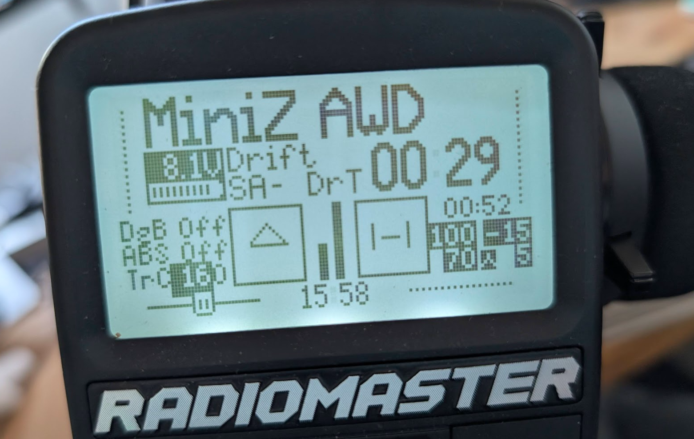

# What

This is the collection of lua scripts that I use in my [EdgeTX](https://github.com/EdgeTX/edgetx) transmitters: MT12 for surface vehicles and Zorro for RC helis, airplanes, gliders, drones, etc.

# Directory

## Telemetry

### car.lua

This is a telemetry screen that displays important setups for RC cars (for my mini-z's and 1/10 touring car and buggy). It's probably not for crawlers.

Is is a lightly modifed version copied from [here](https://www.rctech.net/forum/showpost.php?p=16138355&postcount=528)

### Mini-z (mz-awd.lua and mz-rwd.lua)

This is a telemetry screen that has shown Drag Brake, ABS, and Traction Control setting along with trim disabled state. The Steering/Throttle rate and expo are also displayed in a more compact way on the lower right corner.

It is a heavy modifed version based on car.lua.

The difference between AWD and RWD is just that RWD doesn't have traction control enabled at all (doesn't need) although I also don't know about ABS. But drag braking is useful (for some).

## Mixes

### drgbrk.lua

TX initiated drag braking simulation

### abs.lua

Anti-lock Braking System (ABS) simulation

### tractl.lua

Traction control simulation

